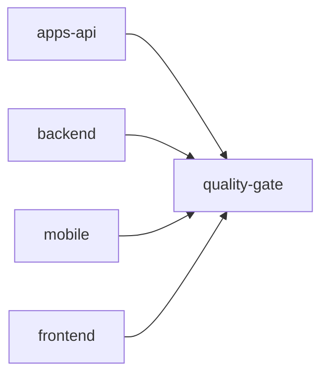

# 🚀 AisleMarts CI/CD Workflow Guide

## Overview

The AisleMarts CI/CD pipeline is designed as a comprehensive, robust workflow that follows best practices for a full-stack monorepo containing backend APIs, frontend React Native/Expo apps, and mobile applications.

## Workflow Structure

### Triggers
- **Push**: `main`, `staging`, `develop` branches
- **Pull Request**: `main`, `staging` branches  
- **Manual**: `workflow_dispatch` for on-demand runs

### Jobs Architecture



## Job Details

### 1. 🔍 `apps-api` - API Specification Validation
- **Purpose**: Validate OpenAPI specifications and generate documentation
- **Environment**: Node.js 20
- **Key Steps**:
  - OpenAPI YAML syntax validation
  - API documentation generation with Redoc
  - Artifact upload for generated docs

### 2. 🐍 `backend` - Backend Tests & Quality
- **Purpose**: Python backend code quality, testing, and security
- **Environment**: Python 3.11 with MongoDB 7.0 service
- **Key Steps**:
  - Dependency installation with fallback handling
  - Flake8 linting (E9, F63, F7, F82 error classes)
  - Pytest testing with coverage
  - Security auditing (Bandit, Safety)
  - Artifact upload for security reports

### 3. 📱 `mobile` - Mobile App Validation  
- **Purpose**: React Native/Expo mobile-specific checks
- **Environment**: Node.js 20 with Yarn
- **Key Steps**:
  - Expo configuration validation
  - Mobile permissions audit
  - EAS build configuration check
  - Mobile-specific testing

### 4. 🎨 `frontend` - Frontend Tests & Quality
- **Purpose**: Frontend code quality, type checking, and testing
- **Environment**: Node.js 20 with Yarn and caching
- **Key Steps**:
  - TypeScript type checking with error threshold (< 400 errors)
  - ESLint code quality with warning threshold (< 70 errors)
  - Jest testing with coverage
  - Expo web build with fallbacks
  - Artifact upload for builds and coverage

### 5. 🎯 `quality-gate` - Quality Gate Summary
- **Purpose**: Aggregate results and provide comprehensive reporting
- **Dependencies**: All other jobs
- **Key Steps**:
  - Job status aggregation
  - Comprehensive CI/CD summary report
  - Pipeline completion verification

## Best Practices Implemented

### ✅ Code Quality
- **Python**: Flake8 linting with selective error checking
- **TypeScript**: Strict type checking with intelligent thresholds
- **JavaScript**: ESLint with Expo configuration

### ⚡ Performance
- **Dependency Caching**: pip, npm/yarn caches for faster builds
- **Parallel Execution**: Independent jobs run simultaneously
- **Selective Installation**: Graceful handling of problematic dependencies

### 🔒 Security
- **Python Security**: Bandit SAST scanning, Safety dependency auditing  
- **Dependencies**: Automated security vulnerability detection
- **Permissions**: Mobile permissions auditing

### 🧪 Testing
- **Backend**: pytest with MongoDB integration testing
- **Frontend**: Jest with coverage reporting
- **Error Handling**: Graceful test failure handling with warnings

### 📊 Monitoring & Reporting
- **Artifacts**: Logs, coverage reports, build outputs
- **Quality Metrics**: Error thresholds and trend tracking
- **Comprehensive Summaries**: Detailed pipeline reporting

## Error Handling Strategy

The pipeline is designed to be **robust and informative** rather than failing fast:

1. **Dependency Issues**: Fallback installation strategies
2. **Code Quality**: Warning thresholds rather than hard failures
3. **Build Failures**: Multiple build strategies with graceful degradation
4. **Test Failures**: Continue pipeline while reporting issues

## Usage

### Running Locally
To test components locally before CI:

```bash
# Backend linting
cd backend && flake8 . --count --select=E9,F63,F7,F82

# Frontend type checking  
cd frontend && npx tsc --noEmit

# API validation
python3 -c "import yaml; yaml.safe_load(open('api/openapi.yaml'))"
```

### Monitoring Results
- Check the **Actions** tab for workflow runs
- Review **Job Summaries** for detailed reports  
- Download **Artifacts** for logs and coverage reports

## Configuration

### Environment Variables
- `NODE_VERSION`: '20' - Node.js version for all JS/TS jobs
- `PYTHON_VERSION`: '3.11' - Python version for backend jobs

### Caching Strategy
- **pip**: `~/.cache/pip` keyed by `requirements.txt`
- **yarn**: `node_modules` keyed by `yarn.lock`
- **npm**: Built-in npm cache for API tools

## Troubleshooting

### Common Issues

1. **TypeScript Errors**: Pipeline allows up to 400 TS errors (current: ~348)
2. **ESLint Warnings**: Pipeline allows up to 70 ESLint errors (current: ~66)
3. **Dependency Conflicts**: Automatic fallback to core dependencies
4. **Build Failures**: Multiple build strategies attempted

### Getting Help
- Review job logs in GitHub Actions
- Check artifact uploads for detailed error reports
- Refer to this guide for expected thresholds and behaviors

---

*This CI/CD pipeline is optimized for the AisleMarts monorepo structure and follows modern DevOps practices while maintaining flexibility for a rapidly evolving codebase.*